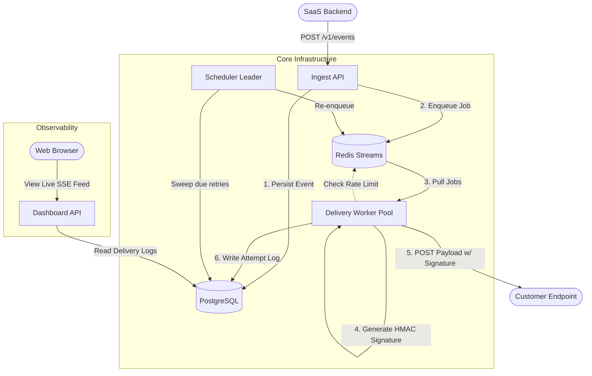
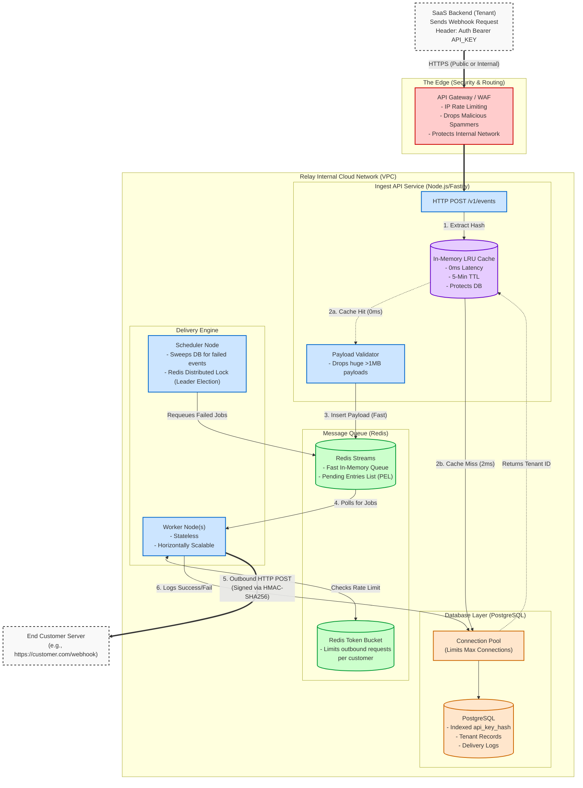

# Relay

> Self-hostable, reliable webhook delivery service. Accepts events from your backend, delivers them to customer endpoints with signing, retries, rate limiting, and a live dashboard.

[](https://typescriptlang.org)
[](https://nodejs.org)
[](LICENSE)

---

## Architecture



### Components

| Service | Port | Description |
|---|---|---|
| `ingest-api` | 3001 | Accepts events, handles idempotency, fans out to endpoints |
| `dashboard-api` | 3002 | Delivery log, replay, SSE feed, serves React UI |
| `worker` | — | Pulls jobs, signs, POSTs to endpoints, writes attempt log |
| `scheduler` | — | Leader-elected sweep for due retries |

---

## Enterprise System Design

This detailed architecture illustrates the security and performance boundaries of the system, including edge defenses and the in-memory caching layer that protects the database from thundering herd attacks.



---

## Quick Start

```bash
# 1. Clone and bring everything up
git clone https://github.com/yourname/relay
cd relay
docker compose up -d

# 2. Create a tenant + endpoint + send test event
./scripts/seed.sh

# 3. Open the dashboard
open http://localhost:3002
```

### Scale workers

```bash
docker compose up --scale worker=4
```

### Scale schedulers (HA leader election)

```bash
docker compose up --scale scheduler=3
# Only one scheduler is active at a time; Redis lock ensures exactly-one
```

---

## API Reference

### Ingest (called by your SaaS backend)

```bash
# Send an event
curl -X POST http://localhost:3001/v1/events \
  -H "Authorization: Bearer <your-api-key>" \
  -H "Content-Type: application/json" \
  -d '{
    "event_type": "invoice.paid",
    "payload": { "invoice_id": "inv_123", "amount": 9900 },
    "idempotency_key": "inv_123_payment"
  }'

# → 202 { "event_id": "uuid", "delivery_count": 2 }
# Duplicate with same idempotency_key → 202 { "event_id": "same-uuid", "duplicate": true }
```

### Endpoint Management

```bash
# Register a destination
curl -X POST http://localhost:3001/v1/endpoints \
  -H "Authorization: Bearer <key>" \
  -d '{ "url": "https://your-server.com/hooks", "secret": "whsec_your_secret_here" }'

# List endpoints
curl http://localhost:3001/v1/endpoints -H "Authorization: Bearer <key>"

# Deactivate
curl -X DELETE http://localhost:3001/v1/endpoints/<id> -H "Authorization: Bearer <key>"
```

### Dashboard / Delivery Log

```bash
# Paginated delivery log
curl "http://localhost:3002/v1/deliveries?status=failed&limit=20" \
  -H "Authorization: Bearer <key>"

# Full attempt history for one delivery
curl http://localhost:3002/v1/deliveries/<id>/attempts \
  -H "Authorization: Bearer <key>"

# Replay a failed delivery
curl -X POST http://localhost:3002/v1/deliveries/<id>/replay \
  -H "Authorization: Bearer <key>"

# Live SSE feed
curl -N http://localhost:3002/v1/stream/deliveries \
  -H "Authorization: Bearer <key>"
```

---

## Webhook Signature Verification

Every delivery is signed with HMAC-SHA256 (same pattern as Stripe):

```
X-Relay-Signature: t=<unix_timestamp>,v1=<hex_signature>
X-Relay-Delivery-Id: <delivery_uuid>
```

**Signature construction:**
```
signed_payload = timestamp + "." + raw_body
signature = HMAC-SHA256(endpoint_secret, signed_payload)
```

**Verify in Node.js:**
```typescript
import { createHmac, timingSafeEqual } from 'node:crypto';

function verifyWebhook(secret: string, header: string, rawBody: string): boolean {
  const parts = Object.fromEntries(header.split(',').map(p => p.split('=')));
  const timestamp = parseInt(parts.t);
  const signature = parts.v1;

  // Reject requests older than 5 minutes
  if (Math.floor(Date.now() / 1000) - timestamp > 300) return false;

  const expected = createHmac('sha256', secret)
    .update(`${timestamp}.${rawBody}`)
    .digest('hex');

  return timingSafeEqual(Buffer.from(signature, 'hex'), Buffer.from(expected, 'hex'));
}
```

**Idempotency:** Use the `X-Relay-Delivery-Id` header to dedupe — you may receive the same delivery twice if a worker crashes after a successful POST but before acknowledging the queue.

---

## Retry Schedule

| Attempt | Delay |
|---|---|
| 1 | ~10 seconds |
| 2 | ~1 minute |
| 3 | ~5 minutes |
| 4 | ~30 minutes |
| 5 | ~2 hours |
| 6 | ~6 hours |
| 7 | ~12 hours |
| 8 | ~24 hours |

After 8 attempts, the delivery is moved to `dead_letter` status and visible in the dashboard. You can always manually replay it.

---

## Failure Modes

| Failure | What happens |
|---|---|
| Customer endpoint down | Retries per backoff schedule, dead-lettered after 8 attempts |
| Worker crashes mid-delivery | Redis Streams PEL — message re-claimed by next worker after 30s |
| Postgres down | Ingest API returns 503; your backend should retry |
| Redis down | Ingest API returns 503; deliveries are not enqueued until recovery |
| Scheduler leader dies | Redis lock expires (15s TTL), standby scheduler acquires it |
| Burst of 10k events | Rate limiter throttles delivery to endpoint (10 req/s default), queue absorbs backlog |

---

## Chaos Testing

```bash
# Make the script executable first
chmod +x scripts/chaos_test.sh

# Run all chaos tests
./scripts/chaos_test.sh http://localhost:3001 http://localhost:3002 <your-api-key>
```

Tests:
1. **Idempotency** — duplicate event with same key returns same event_id
2. **Worker crash** — kill a worker; message is reclaimed and delivered by another
3. **Leader failover** — kill the scheduler leader; standby takes over within 15s
4. **Burst** — 50 concurrent events accepted without error

---

## Load Testing

```bash
# Install k6: brew install k6
k6 run scripts/load_test.js \
  -e API_KEY=<your-key> \
  -e INGEST_URL=http://localhost:3001
```

Thresholds: 99% success rate, p95 latency < 200ms at 50 concurrent users.

---

## Project Structure

```
relay/
├── apps/
│   ├── ingest-api/      POST /v1/events, endpoint management
│   ├── dashboard-api/   delivery log, replay, SSE, React UI
│   ├── worker/          delivery execution
│   └── scheduler/       leader-elected retry sweep
├── packages/
│   ├── db/              Postgres client + repositories
│   ├── signing/         HMAC-SHA256 sign + verify
│   ├── backoff/         exponential + jitter
│   ├── queue/           Redis Streams abstraction
│   └── ratelimit/       Redis token bucket
├── migrations/          SQL schema
├── dashboard/           React + Vite frontend
├── scripts/
│   ├── seed.sh          Bootstrap a test tenant
│   ├── chaos_test.sh    Failure scenario tests
│   └── load_test.js     k6 load test
└── docker-compose.yml
```

---

## Environment Variables

| Variable | Default | Description |
|---|---|---|
| `DATABASE_URL` | — | Postgres connection string |
| `REDIS_URL` | `redis://localhost:6379` | Redis connection |
| `PORT` | 3001 / 3002 | HTTP port (per service) |
| `HTTP_TIMEOUT_MS` | `10000` | Outbound webhook timeout |
| `SWEEP_INTERVAL_MS` | `5000` | Retry sweep frequency |
| `SWEEP_BATCH_SIZE` | `500` | Max deliveries per sweep |
| `MAX_DELIVERY_ATTEMPTS` | from tenant row | Per-tenant override |

---

## License

MIT
